# Behaviour view

This documentations is focused on the runtime behaviour of the system, how processes comunicate, concurrency, sychronization, performance an so on.

## Artefacts 

### Sequence Diagrams

#### User Register Module

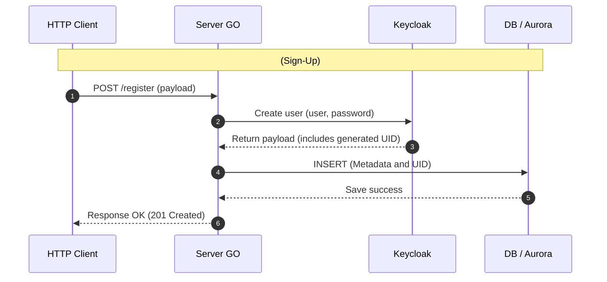

#### User Login Module

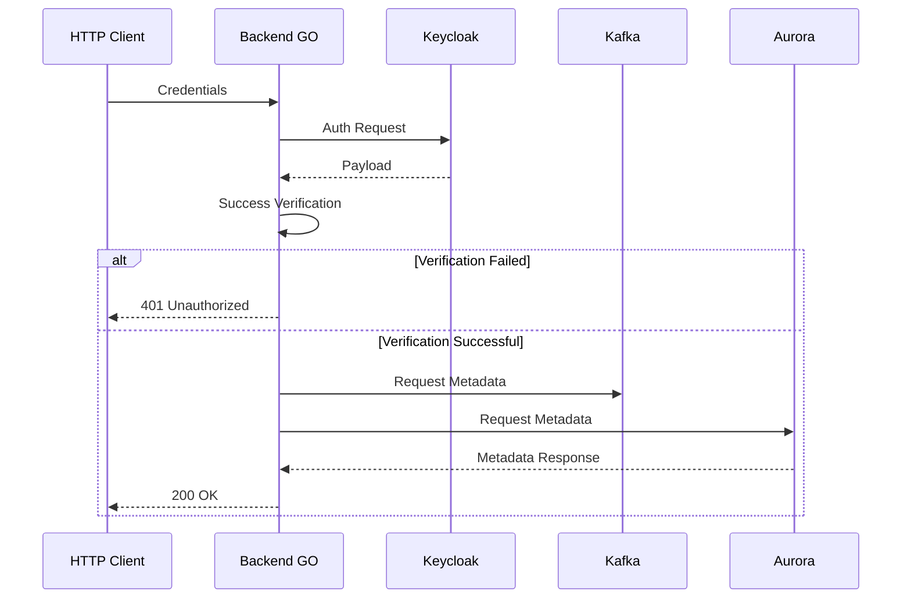

#### JWT Session Verification Flow

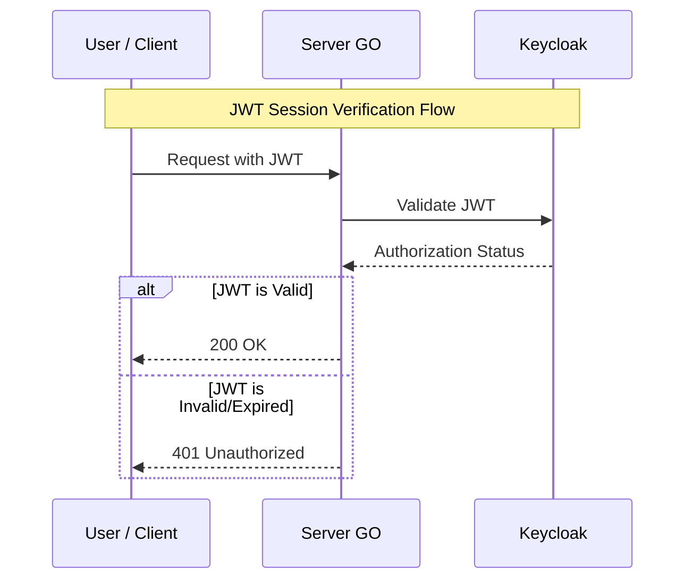

### Clothes image ingestion & registration

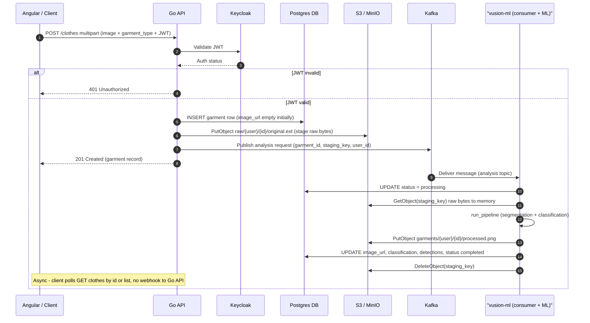

#### Clothes Recomendation Module

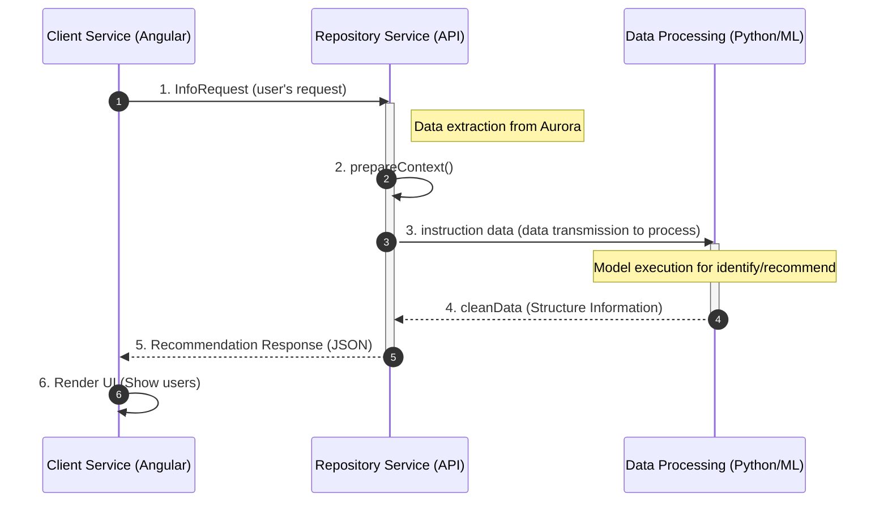

#### Repository Module

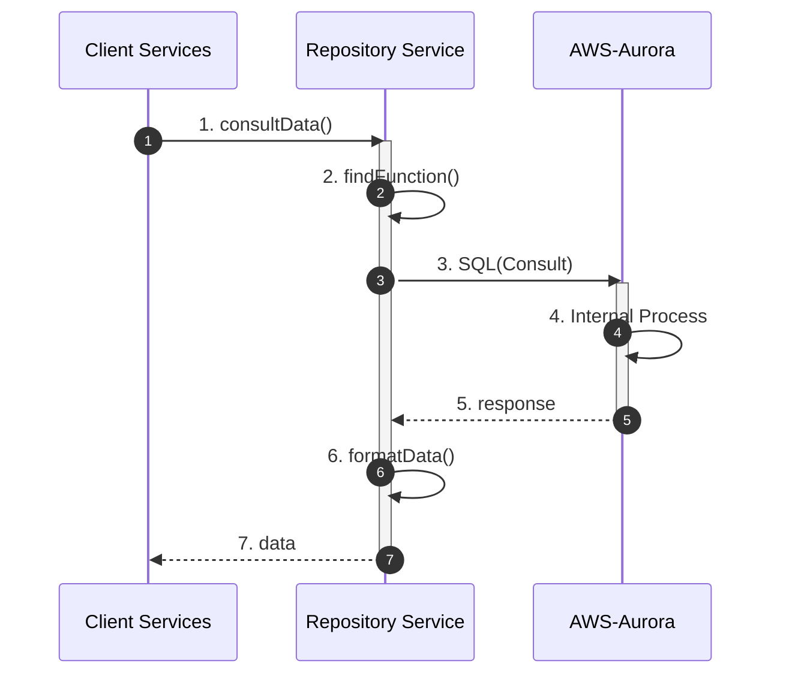

### Comunication Diagram

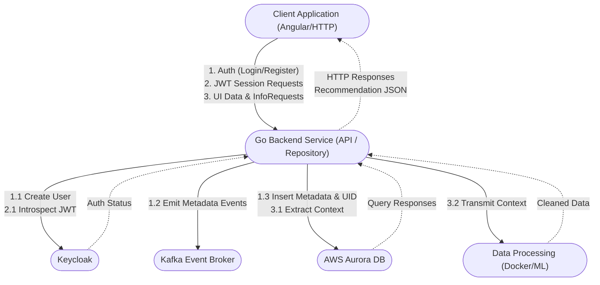
### Interaction Overview

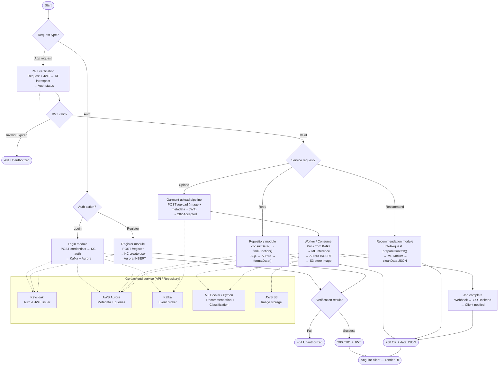

### State Diagrams

#### Upload Job Lifecycle

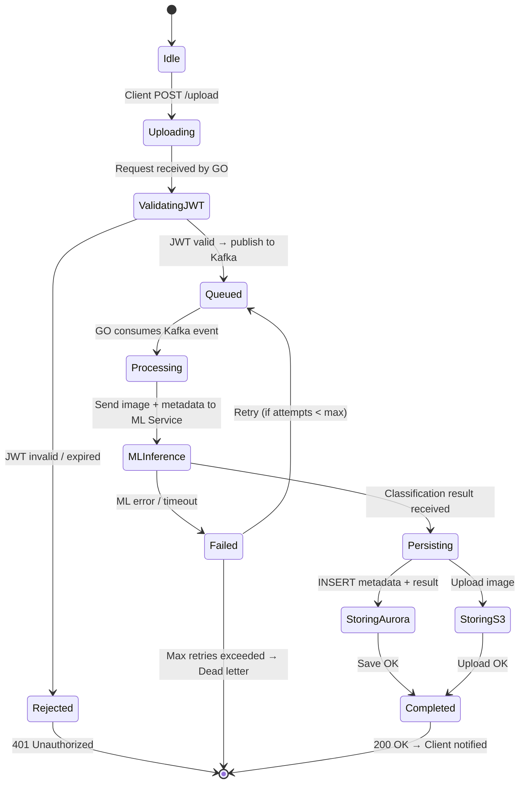
#### JWT Session
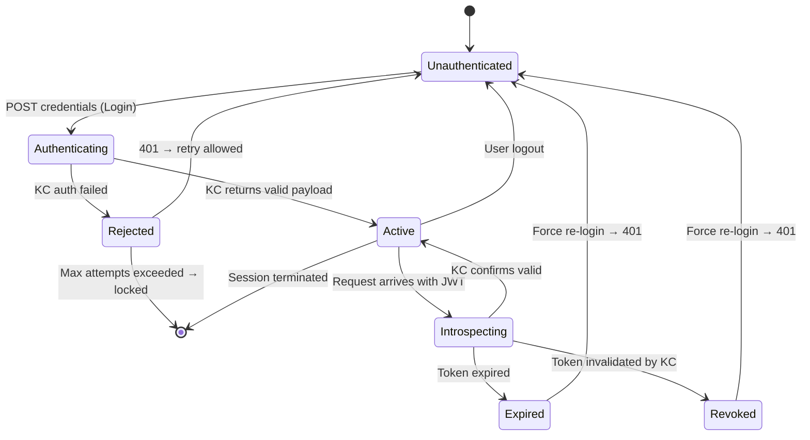

#### User Account

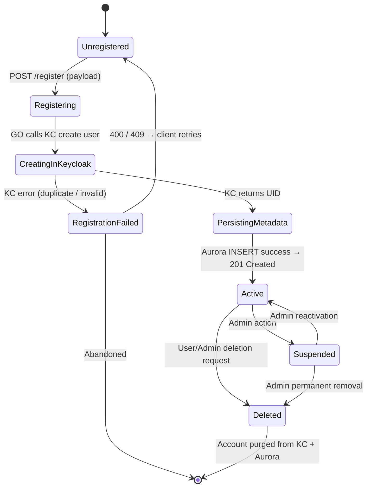

