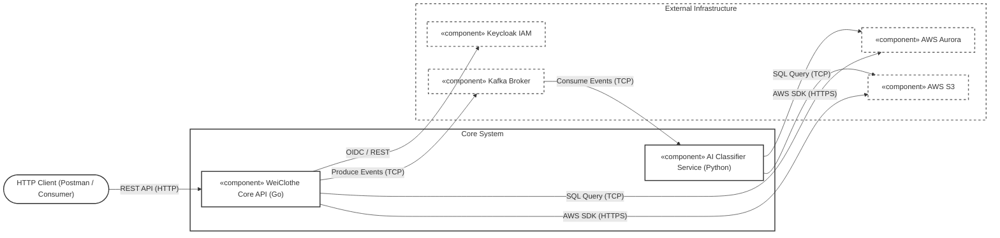

## component 

 The Go Core API acts as the primary entry point, exposing a REST interface to clients while securely managing identity delegation through Keycloak via OIDC. The architecture enforces a decoupling of concerns by utilizing Kafka as an event broker over TCP. This allows the Go backend to offload heavy image processing tasks asynchronously to the isolated Python AI Classifier service. Both core components persist data by interfacing directly with AWS Aurora (via TCP/SQL) and AWS S3 (via HTTPS/AWS SDK)

