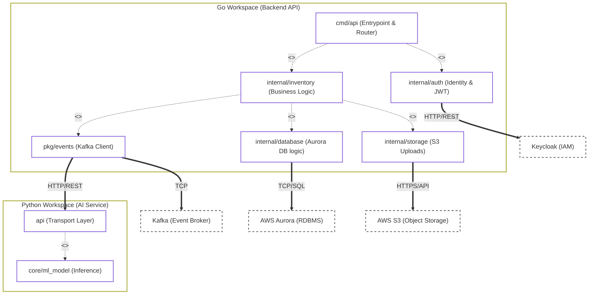

## package

The WeiClothe backend is built in Go using a standard domain-driven layout. The cmd/api package serves as the entry point, routing requests to the private internal/ modules where the core business logic (auth, inventory, and database connections) lives. We use pkg/ for reusable tools like our Kafka event publisher

