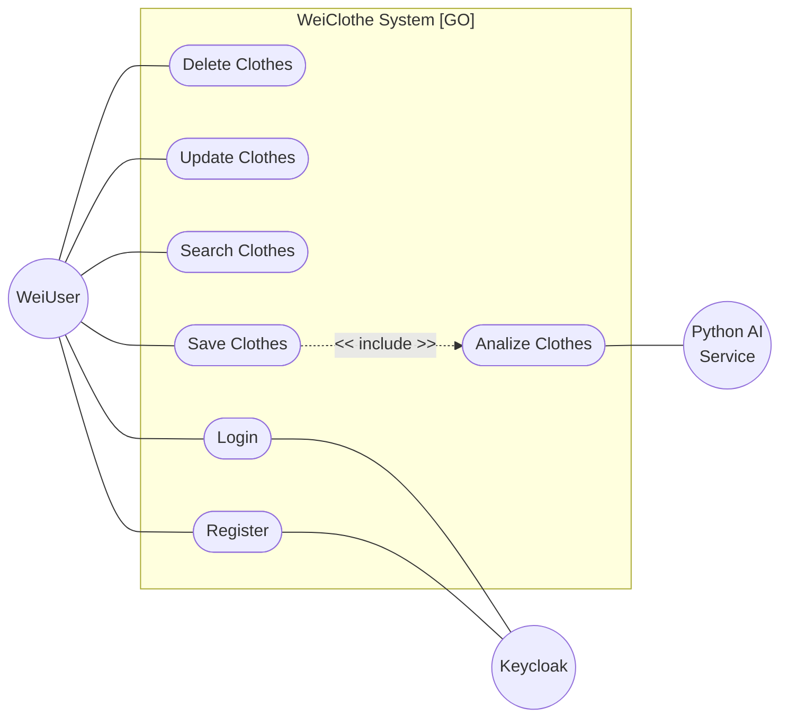

## Use case

The central rectangular boundary represents the core system (the Go backend), which encapsulates the 8 main use cases. The diagram defines three Actors interacting with the system: the WeiUser (primary actor), alongside Python AI Service and Keycloak (secondary external systems). Furthermore, the <<include>> relationship indicates that a base use case obligatorily invokes the functionality of the included use case as part of its execution (e.g., saving a clothe always triggers the AI analysis)

