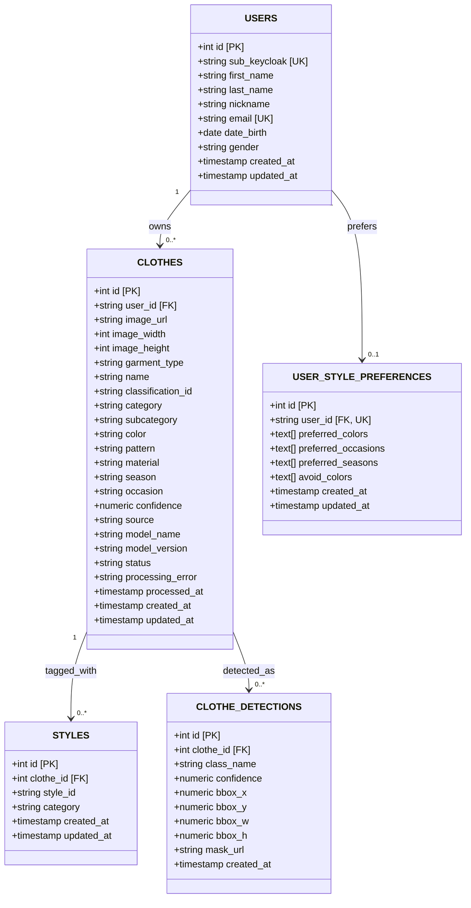

The following Entity-Relationship diagram reflects the current PostgreSQL schema (`GoClient/db/init.sql` plus migrations). It shows primary entities, attributes, relationships, and key constraints.

**Relationships**

| From | To | Cardinality | FK |
|------|-----|-------------|-----|
| `users` | `clothes` | 1:N | `clothes.user_id` → `users.sub_keycloak` |
| `users` | `user_style_preferences` | 1:1 | `user_style_preferences.user_id` → `users.sub_keycloak` |
| `clothes` | `styles` | 1:N | `styles.clothe_id` → `clothes.id` |
| `clothes` | `clothe_detections` | 1:N | `clothe_detections.clothe_id` → `clothes.id` (ON DELETE CASCADE) |

**Notable constraints**

- `clothes.status` ∈ `queued`, `processing`, `completed`, `failed`
- `clothes.source` ∈ `ai`, `manual`, `ai+manual`
- `clothes.confidence` ∈ [0, 1] when set
- `clothes.image_url` unique only when NOT NULL (partial index)
- `user_style_preferences.user_id` unique (one row per user)

**Indexes** (non-PK)

| Table | Index |
|-------|--------|
| `clothes` | `user_id`, `status`, `category`, `processed_at`, `color`, `material`, `occasion`, `season`, `pattern`; partial unique on `image_url` |
| `clothe_detections` | `clothe_id` |
| `user_style_preferences` | `user_id` |
