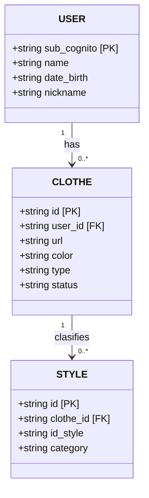

The following Entity-Relationship diagram illustrates the foundational database architecture. It maps the primary entities, their attributes, and the relationships between them. Specifically, it highlights a one-to-many (1:N) relationship between User and Clothe (a single user can own multiple clothing items), as well as the association between the Clothe and Style entities. Furthermore, the diagram explicitly defines the Primary Keys (PK) used for unique record identification, and the Foreign Keys (FK) that enforce referential integrity

